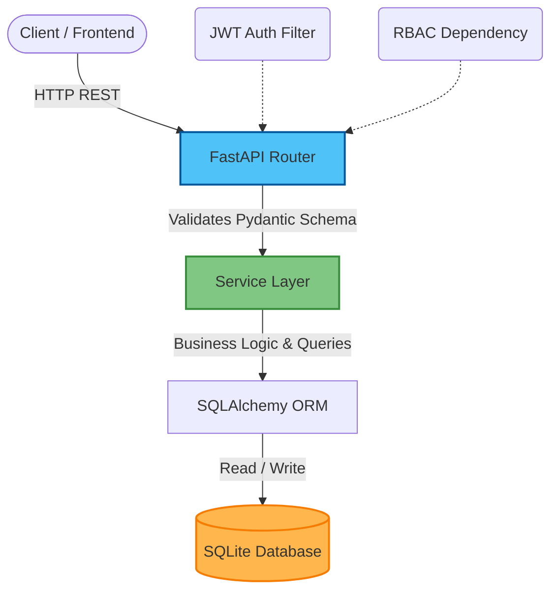

# Finance Dashboard Backend

A backend API for a finance dashboard system built with **FastAPI** and **SQLite**.
Supports role-based access control, financial record management, and summary-level analytics.

---

## Tech Stack

| Layer | Choice | Reason |
|---|---|---|
| Framework | FastAPI | Fast, async-ready, auto-generates OpenAPI docs |
| ORM | SQLAlchemy 2.x | Makes easy to migrate to any databases like mysql|
| Database | SQLite | Zero-setup for reviewers; production-swap requires one config line |
| Auth | JWT (python-jose + passlib/bcrypt) | Stateless, industry standard |
| Validation | Pydantic v2 | Strict type checking, clear error messages |
| Testing | pytest + httpx TestClient | Isolated in-memory DB per test |

---

## System Architecture



---

## Quickstart (3 commands)

```bash
pip install -r requirements.txt
python seed.py          # Populates db with test users and data
uvicorn app.main:app --reload
```

Then open **http://localhost:8000/docs** for interactive Swagger UI.

### Test accounts

| Role | Email | Password |
|---|---|---|
| Admin | admin@zovryn.com | adminpass |
| Analyst | analyst@zovryn.com | analystpass |
| Viewer | viewer@zovryn.com | viewerpass |

Use the **Authorize** button in Swagger UI → log in with any account above → test role restrictions live.

---

## Project Structure

```
app/
├── main.py              
├── config.py            
├── database.py          
├── exceptions.py       
├── models/
│   ├── user.py          
│   └── record.py        
├── schemas/
│   ├── auth.py          
│   ├── user.py          
│   ├── record.py        
│   └── dashboard.py     
├── services/
│   ├── auth_service.py     
│   ├── user_service.py      
│   ├── record_service.py    
│   └── dashboard_service.py 
├── api/
│   ├── deps.py              
│   └── routes/
│       ├── auth.py          
│       ├── users.py         
│       ├── records.py       
│       └── dashboard.py     
├── utils/
│   └── security.py         
tests/
├── conftest.py          
├── test_auth.py         
├── test_records.py     
└── test_dashboard.py    
```

---

## API Reference

### Auth
| Method | Path | Auth | Description |
|---|---|---|---|
| POST | `/api/auth/register` | None | Create a new account (defaults to Viewer) |
| POST | `/api/auth/login` | None | Get JWT token |
| GET | `/api/auth/me` | Any | Get your own profile |

### Users (Admin only)
| Method | Path | Description |
|---|---|---|
| GET | `/api/users` | List all users |
| GET | `/api/users/{id}` | Get user details |
| PATCH | `/api/users/{id}/role` | Change role |
| PATCH | `/api/users/{id}/status` | Activate/deactivate |

### Records
| Method | Path | Who | Description |
|---|---|---|---|
| GET | `/api/records` | All roles | List with filters + pagination |
| GET | `/api/records/{id}` | All roles | Get single record |
| POST | `/api/records` | Admin | Create record |
| PUT | `/api/records/{id}` | Admin | Update record |
| DELETE | `/api/records/{id}` | Admin | Soft delete |

**Query filters:** `?type=income`, `?category=salary`, `?date_from=2024-01-01`, `?date_to=2024-12-31`, `?page=1`, `?per_page=20`

### Dashboard (Admin + Analyst only)
| Method | Path | Description |
|---|---|---|
| GET | `/api/dashboard/summary` | Total income, expenses, net balance |
| GET | `/api/dashboard/category-breakdown` | Totals per category (income + expense) |
| GET | `/api/dashboard/trends` | Monthly income/expense for trailing 12 months |
| GET | `/api/dashboard/recent` | Last 10 transactions |

---

## Access Control Matrix

| Action | Viewer | Analyst | Admin |
|---|---|---|---|
| View own records | ✅ | ✅ | ✅ |
| View ALL records | ❌ | ✅ | ✅ |
| Dashboard analytics | ❌ | ✅ | ✅ |
| Create / Update records | ❌ | ❌ | ✅ |
| Soft-delete records | ❌ | ❌ | ✅ |
| Manage users | ❌ | ❌ | ✅ |

**How it's enforced:** A `require_role()` FastAPI dependency factory is applied at the route level. No conditional `if user.role == ...` logic scattered through route handlers — RBAC is declared once, cleanly.

---

## Design Decisions & Architecture Notes

### Why Service Layer?
Business logic lives in `app/services/`, not in route handlers. Route handlers only parse the request and return the response. This means services are fully unit-testable without HTTP, and adding a CLI or background worker later doesn't require duplicating logic.

### Why Soft Delete?
Financial records should never disappear permanently. Deleting a record sets `is_deleted=True`. All queries automatically filter these out. This is a domain-appropriate decision — audit trails matter in finance.

### Why SQLite (not Postgres)?
Zero setup for the reviewer. The SQLAlchemy abstraction layer means switching to Postgres requires changing exactly one line in `.env` (`DATABASE_URL=postgresql://...`). The service and model layers need zero changes.

### Why JWT (not sessions)?
REST APIs are stateless. JWTs carry the user identity and role in the token itself — no session store required. Tradeoff: tokens can't be revoked server-side before expiry (30 min default). In production, a token blocklist or refresh-token rotation pattern would handle this.

---

## Assumptions Made

1. **Record ownership vs. visibility**: All records are global (not user-owned). Viewers see all records but cannot create/modify them. Analysts and Admins see all records. I considered viewer owns record scoping but the assignment said "Viewer can only view dashboard data" which implies read-only access to shared data, not private data.

2. **First user is not auto-promoted to Admin**: All registrations default to Viewer for security. The seed script promotes specific accounts to Admin/Analyst. In production, an "initial setup" flow would handle this.

3. **Soft delete is the only delete**: Admins cannot permanently purge records via the API. This is because financial data needs integrity.

4. **No Alembic migrations**: `create_all()` at startup creates tables. For production, Alembic would handle incremental schema changes. Noted as an explicit tradeoff.

5. **Amount precision**: Amounts are stored as `Float` and rounded to 2 decimal places in the API layer. For a real financial system, `Decimal` with `NUMERIC(precision, scale)` would be used to avoid floating-point errors.

---

## Running Tests

```bash
pytest -v tests/
```

Tests use an isolated **in-memory SQLite database** (never touches `finance.db`). Each test function gets a fresh, empty database via the `db_session` fixture.
